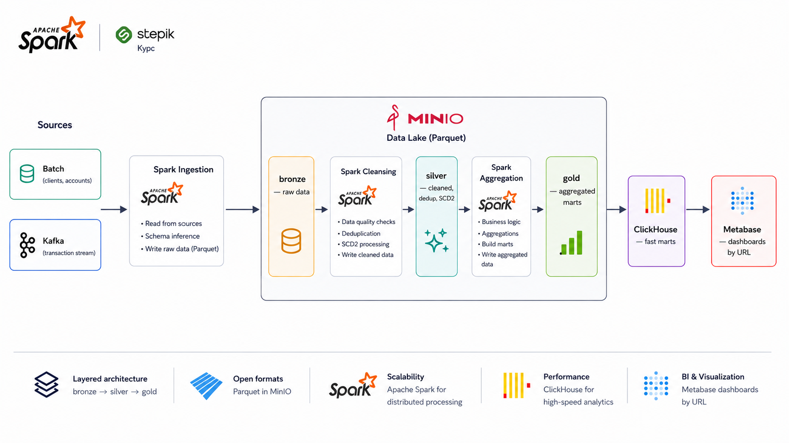

# Apache Spark Course — End-to-End Data Pipeline

Учебный, но приближенный к проду пайплайн обработки данных на **Apache Spark** с медальон-архитектурой (bronze → silver → gold). Весь стек поднимается одной командой через Docker Compose, а результат виден в BI-дашбордах по URL.

Проект сделан в рамках курса «PySpark с нуля».

---

## Стек

| Сервис | Роль | Прод-аналог |
|---|---|---|
| **Apache Spark** (+ Jupyter) | Движок обработки + среда разработки | Databricks / EMR / DataProc |
| **MinIO** | S3-совместимое озеро (слои bronze/silver/gold) | AWS S3 / Yandex Object Storage |
| **Apache Kafka** | Поток событий (стриминг), KRaft-режим | Kafka в проде |
| **ClickHouse** | Аналитическое хранилище витрин (gold) | ClickHouse / GreenPlum |
| **Metabase** | BI-дашборды по URL | Metabase / Superset / Tableau |

Все образы multi-arch — работают на Apple Silicon (ARM64) и amd64.

---

## Архитектура



**Медальон-архитектура:**
- 🥉 **Bronze** — сырые данные «как пришли» из источника (приземлились в озеро)
- 🥈 **Silver** — очищенные, типизированные, дедуплицированные (правила качества, SCD2)
- 🥇 **Gold** — бизнес-витрины: агрегаты и метрики, выгружаются в ClickHouse для BI

> Spark **не читает** боевые OLTP-источники напрямую — данные сначала приземляются
> в озеро (bronze), как через CDC/файловый обмен в реальных банковских платформах.

---

## ⚠️ Минимальные системные требования

Стек из 5 сервисов требует ресурсов. Перед запуском убедитесь:

| Ресурс | Минимум | Рекомендуется |
|---|---|---|
| **RAM (свободно)** | 10 ГБ | 12–16 ГБ |
| **CPU** | 4 ядра | 4–6 ядер |
| **Диск (свободно)** | 20 ГБ | 25+ ГБ |

**macOS (Colima):** обязательно запускайте движок с увеличенными ресурсами, иначе
Spark и Kafka упадут с нехваткой памяти:

```bash
colima start --cpu 4 --memory 12
```

**Docker Desktop (Win/Mac):** Settings → Resources → выставьте Memory ≥ 10 ГБ, CPU ≥ 4.

---

## Быстрый старт

```bash
# 1. Клонировать
git clone https://github.com/socloseeee/apache_spark_course.git
cd apache_spark_course

# 2. Создать .env из шаблона
cp .env.example .env

# 3. Поднять стек (первый запуск долгий — качаются образы)
docker compose up -d

# 4. Проверить живость
docker compose ps
```

### Доступ к интерфейсам

| Сервис | URL | Доступ |
|---|---|---|
| JupyterLab | http://localhost:8888/lab?token=spark | токен `spark` |
| MinIO-консоль | http://localhost:9001 | `minioadmin` / `minioadmin` |
| ClickHouse HTTP | http://localhost:8123 | `spark` / `spark` |
| Metabase | http://localhost:3000 | мастер задаётся при первом входе |
| Spark UI | http://localhost:4040 | когда запущена Spark-сессия |

---

## Подключение к сервисам

Адрес зависит от того, **откуда** подключаешься:

| Сервис | Из контейнера (Jupyter) | С хоста |
|---|---|---|
| MinIO | `minio:9000` | `localhost:9000` |
| Kafka | `kafka:19092` | `localhost:9092` |
| ClickHouse | `clickhouse:8123` | `localhost:8123` |

Правило: **внутри сети Docker — по имени сервиса, с хоста — через localhost**.

---

## Структура проекта

```
apache_spark_course/
├── docker-compose.yml       # стек (5 сервисов)
├── .env.example             # шаблон секретов
├── .gitignore
├── conf/
│   └── spark-defaults.conf  # настройки Spark: MinIO (s3a), Kafka, ClickHouse
├── data-generator/
│   └── generate.py          # генератор данных (источники)
└── notebooks/               # ноутбуки пайплайна (bronze/silver/gold)
```

---

## Управление стеком

```bash
docker compose up -d        # запустить
docker compose ps           # статус
docker compose logs -f <s>  # логи сервиса
docker compose stop         # пауза (данные целы)
docker compose down         # удалить контейнеры (данные в volumes целы)
docker compose down -v      # удалить всё, включая данные
```

---

## Оркестрация (вне скоупа)

В проде запуск пайплайна по расписанию делает **Apache Airflow**. В этом проекте
оркестрация не настраивается (это отдельный навык) — ноутбуки запускаются вручную.
Концептуально каждый этап (bronze → silver → gold) стал бы задачей в Airflow DAG.

---


## Версии (закреплены намеренно)

Образ Jupyter закреплён на `spark-3.5.3` — НЕ `latest`. Это обеспечивает
воспроизводимость: `latest` со временем уезжает на новые версии Spark, ломая
совместимость пакетов (Delta, Kafka-коннектор). Все версии согласованы:

| Компонент | Версия |
|---|---|
| Spark | 3.5.3 (Scala 2.12) |
| Delta Lake | 3.3.0 |
| hadoop-aws | 3.3.4 |
| spark-sql-kafka | 3.5.3 |

## Автор

**Bogdan** — Data Engineer
[GitHub](https://github.com/socloseeee) · [Telegram](https://t.me/socloseeee)