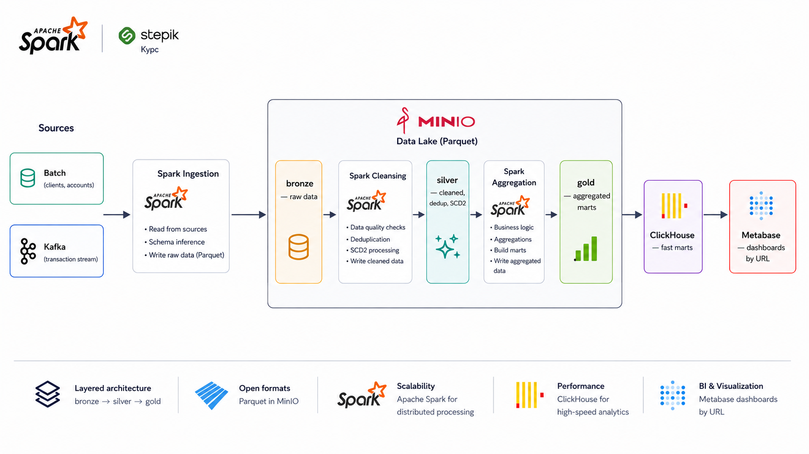
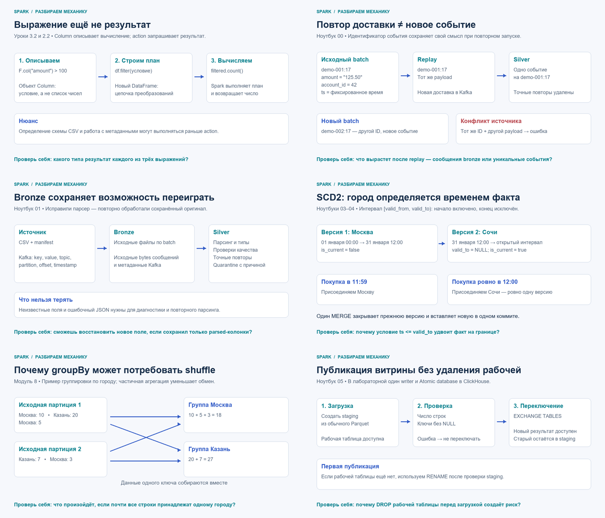
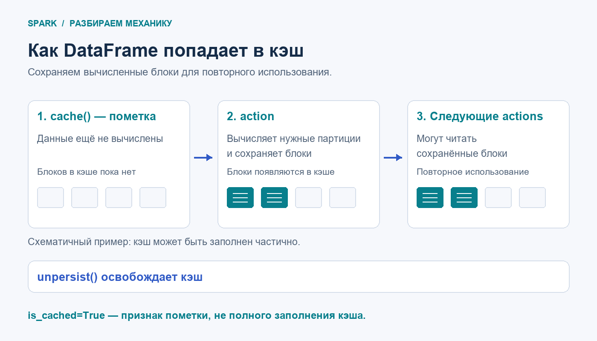

# Apache Spark Course — End-to-End Data Pipeline

Локальная учебная лабораторная обработки данных на **Apache Spark** с медальон-архитектурой (bronze → silver → gold). Весь стек поднимается одной командой через Docker Compose, а результат виден в BI-дашбордах по URL.

Проект сделан в рамках курса «PySpark с нуля».

---

## Стек

| Сервис | Роль | Прод-аналог |
|---|---|---|
| **Apache Spark** (+ Jupyter) | Движок обработки + среда разработки | Databricks / EMR / DataProc |
| **MinIO** | S3-совместимое озеро (слои bronze/silver/gold) | AWS S3 / Yandex Object Storage |
| **Apache Kafka** | Поток событий (стриминг), KRaft-режим | Kafka в проде |
| **ClickHouse** | Аналитическое хранилище витрин (gold) | ClickHouse / GreenPlum |
| **Metabase** | BI-дашборды по URL | Metabase / Superset / Tableau |

Теги образов закреплены. 17.09.2026 стек прошёл два полных запуска в изолированной среде Docker Desktop. Условия и ограничения проверки приведены в [VALIDATION.md](VALIDATION.md); совместимость с другими архитектурами отдельно не подтверждена.

---

## Архитектура



**Медальон-архитектура:**
- 🥉 **Bronze** — сырые данные «как пришли» из источника (приземлились в озеро)
- 🥈 **Silver** — очищенные, типизированные, дедуплицированные (правила качества, SCD2)
- 🥇 **Gold** — бизнес-витрины: агрегаты и метрики, выгружаются в ClickHouse для BI

> Spark **не читает** боевые OLTP-источники напрямую — данные сначала приземляются
> в озеро (bronze), как через CDC/файловый обмен в реальных банковских платформах.

---

## ⚠️ Минимальные системные требования

Стек из 5 сервисов требует ресурсов. Перед запуском убедитесь:

| Ресурс | Минимум | Рекомендуется |
|---|---|---|
| **RAM (свободно)** | 10 ГБ | 12–16 ГБ |
| **CPU** | 4 ядра | 4–6 ядер |
| **Диск (свободно)** | 20 ГБ | 25+ ГБ |

**macOS (Colima):** обязательно запускайте движок с увеличенными ресурсами, иначе
Spark и Kafka упадут с нехваткой памяти:

```bash
colima start --cpu 4 --memory 12
```

**Docker Desktop (Win/Mac):** Settings → Resources → выставьте Memory ≥ 10 ГБ, CPU ≥ 4.

---

## Быстрый старт

Редакция v2 меняет схемы и пути. Используйте отдельную копию проекта, остановив прежний учебный стек. Существующие таблицы старой лабораторной не удаляются автоматически. Не переносите существующие volumes Metabase/ClickHouse между разными версиями без проверки совместимости.


```bash
# 1. Распаковать полученный архив исправлений и открыть папку проекта
# Эта редакция пока не отправлена в удалённый GitHub-репозиторий.
cd apache_spark_course

# 2. Создать .env из шаблона
cp .env.example .env

# 3. Поднять стек (первый запуск долгий — качаются образы)
docker compose up -d

# 4. Проверить живость
docker compose ps
```

### Доступ к интерфейсам

| Сервис | URL | Доступ |
|---|---|---|
| JupyterLab | http://localhost:8888/lab?token=spark | токен `spark` |
| MinIO-консоль | http://localhost:9001 | `minioadmin` / `minioadmin` |
| ClickHouse HTTP | http://localhost:8123 | `spark` / `spark` |
| Metabase | http://localhost:3000 | мастер задаётся при первом входе |
| Spark UI | http://localhost:4040 | когда запущена Spark-сессия |

---

## Подключение к сервисам

Адрес зависит от того, **откуда** подключаешься:

| Сервис | Из контейнера (Jupyter) | С хоста |
|---|---|---|
| MinIO | `minio:9000` | `localhost:9000` |
| Kafka | `kafka:19092` | `localhost:9092` |
| ClickHouse | `clickhouse:8123` | `localhost:8123` |

Правило: **внутри сети Docker — по имени сервиса, с хоста — через localhost**.

---

## Структура проекта

```
apache_spark_course/
├── docker-compose.yml       # стек (5 сервисов)
├── .env.example             # шаблон секретов
├── .gitignore
├── conf/
│   └── spark-defaults.conf  # настройки Spark: MinIO (s3a), Kafka, ClickHouse
├── data-generator/
│   └── generate.py          # генератор данных (источники)
└── notebooks/               # ноутбуки пайплайна (bronze/silver/gold)
```

---

## Управление стеком

```bash
docker compose up -d        # запустить
docker compose ps           # статус
docker compose logs -f <s>  # логи сервиса
docker compose stop         # пауза (данные целы)
docker compose down         # удалить контейнеры (данные в volumes целы)
docker compose down -v      # удалить всё, включая данные
```

---

## Оркестрация (вне скоупа)

В проде запуск пайплайна по расписанию делает **Apache Airflow**. В этом проекте
оркестрация не настраивается (это отдельный навык) — ноутбуки запускаются вручную.
Концептуально каждый этап (bronze → silver → gold) стал бы задачей в Airflow DAG.

---


## Версии (закреплены для проверки этой редакции)

Образ Jupyter закреплён на `spark-3.5.3` — НЕ `latest`. Это ограничивает дрейф версий: `latest` со временем уезжает на новые версии Spark, ломая
совместимость пакетов (Delta, Kafka-коннектор). Spark и Delta выбраны по матрице совместимости. Сквозной прогон с этими версиями выполнен 17.09.2026:

| Компонент | Версия |
|---|---|
| Spark | 3.5.3 (Scala 2.12) |
| Delta Lake | 3.3.0 |
| hadoop-aws | 3.3.4 |
| spark-sql-kafka | 3.5.3 |

## Маршрут ноутбуков

1. `00_generate_data`: воспроизводимый batch и replay.
2. `01_ingestion`: оригинальные файлы и Kafka metadata в bronze.
3. `02_silver`: типы, quarantine, точные дубли и контроль связей.
4. `03_silver_scd2`: один MERGE, интервалы и проверка повторной загрузки.
5. `04_gold`: объём успешных покупок по атрибутам клиента на время операции.
6. `05_clickhouse`: staging и переключение витрины.

`practice_real_spark` — короткий переход после тренажёра Stepik, до большого проекта.
Вспомогательные проверки готовы; ученику не нужно проектировать тестовый фреймворк.
После работы с каждым notebook завершайте его kernel перед следующим: иначе несколько
Spark-контекстов разных kernels одновременно займут память.

## Контракт учебных данных

- Базовый batch: `demo-001`, seed 42, as-of `2026-02-01T00:00:00` UTC.
- Повтор тех же параметров воспроизводит те же ID и payload. Новый batch-id даёт новые event IDs.
  Новое имя задайте в `BATCH_ID` ноутбуков 00, 01 и 02,
  затем выполните 00–05 по порядку. Для replay оставьте прежнее имя и параметры.
- Деньги передаются точными строками и обрабатываются как Decimal(18,2), валюта RUB.
- Метрика витрин — сумма completed purchase. Это объём покупок, не выручка и не net sales.
- Silver целиком пересчитывается для выбранного batch; накопительная многобатчевая витрина не реализована.
- SCD2: один writer; вход по времени; один вариант состояния клиента на batch. Известная
  сохранённая версия распознаётся при replay. Поздние неизвестные изменения отклоняются.
- Дата первого состояния — условие синтетического сценария, не вывод из даты регистрации.
- Отрицательный balance считается браком только по контракту этой лабораторной.
- Денежный формат источника: обычная десятичная запись с ASCII-цифрами, точкой и
  максимум двумя дробными знаками; пробелы по краям допускаются. Дробные копейки,
  экспонента, запятая, знак `+` и переполнение Decimal(18,2) отклоняются.
  `amount` должен быть больше нуля, `balance` — не меньше нуля. Исходный текст
  отклонённой суммы сохраняется в quarantine; скрытого округления при приёмке нет.
- Kafka хранит данные в volume, retention времени отключён для повторяемости лабораторной.
  Обычный `stop/down` сохраняет named volumes; удаление volumes — отдельный явный reset.

## Проверки автора

В Jupyter после установки requirements:

```python
import subprocess, sys
subprocess.run([sys.executable, "-m", "pytest", "tests", "-q"], check=True)
```

Интеграционные тесты требуют реального Spark с Delta extensions/JAR. Если зависимости
отсутствуют, соответствующий модуль помечается skipped; это не успешная проверка SCD2.
Для приёмки необходимо: ни одного skipped в контейнере; затем notebooks 00–05 по порядку,
повтор 00–05 и сверка результата; restart/recreate Kafka с сохранённым checkpoint.
После успешного pull сохраните digests командой `docker compose config --resolve-image-digests`.

### Зафиксированные сервисы

MinIO: RELEASE.2025-04-22T22-12-26Z; mc: RELEASE.2025-07-16T15-35-03Z;
ClickHouse: 25.3.2.39; Metabase: v0.54.6; Kafka: 3.9.0.
Это версии для воспроизводимой локальной редакции, не рекомендация production-развёртывания.
MinIO и mc загружаются из официального реестра `quay.io/minio`: pull указанных
версий подтверждён 16–17.09.2026. Старые адреса Docker Hub в проверке возвращали
ошибку доступа. Первую подготовку прав нового Kafka volume выполняет короткий
сервис `kafka-init`; Kafka ждёт его успешного завершения. Это часть обычного
`docker compose up -d`, отдельная команда ученику не нужна.
Полный прогон и подключение Metabase к ClickHouse проверены; подробности — в `VALIDATION.md`.
Короткая инструкция для трёх карточек: [Контрольный дашборд](course-texts/metabase-dashboard-guide.md).

## Иллюстрации





PNG готовы для Stepik; SVG — редактируемые оригиналы. Места вставки и alt-тексты:
`assets/illustrations.json`. В notebooks рисунки уже подключены через mount assets.

## Автор

**Bogdan** — Data Engineer
[GitHub](https://github.com/socloseeee) · [Telegram](https://t.me/socloseeee)

### Формат идентификаторов Silver

В CSV client_id/account_id принимаются как положительные целые в пределах LongType.
Формат проверяется до приведения: `101.5` не должен стать другим ключом `101`.
Исходный текст ID отклонённых строк сохраняется в quarantine. Пробельные ID
операций отклоняются. [Авторская проверка и ограничения](course-texts/silver-quality-validation-20260921.md).
